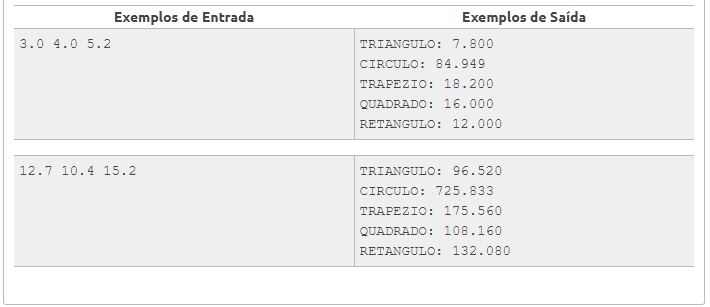

beecrowd | 1012

# Área

Adaptado por Neilor Tonin, URI  Brasil

Escreva um programa que leia três valores com ponto flutuante de dupla precisão: A, B e C. Em seguida, calcule e mostre:
1. a área do triângulo retângulo que tem A por base e C por altura.
2. a área do círculo de raio C. (pi = 3.14159)
3. a área do trapézio que tem A e B por bases e C por altura.
4. a área do quadrado que tem lado B.
5. a área do retângulo que tem lados A e B.

## Entrada
O arquivo de entrada contém três valores com um dígito após o ponto decimal.

## Saída
O arquivo de saída deverá conter 5 linhas de dados. Cada linha corresponde a uma das áreas descritas acima, sempre com mensagem correspondente e um espaço entre os dois pontos e o valor. O valor calculado deve ser apresentado com 3 dígitos após o ponto decimal.

