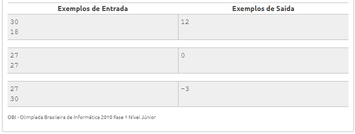

beecrowd | 2374

# Pneu

Por OBI - Olimpíada Brasileira de Informática 2010 BR Brazil

Calibrar os pneus do carro deve ser uma tarefa cotidiana de todos os motoristas. Para isto, os postos de gasolina possuem uma bomba de ar. A maioria das bombas atuais são eletrônicas, permitindo que o motorista indique a pressão desejada num teclado. Ao ser ligada ao pneu, a bomba primeiro lê a pressão atual e calcula a diferença de pressão entre a desejada e a lida. Com esta diferença ela esvazia ou enche o pneu para chegar na pressão correta.

Sua ajuda foi requisitada para desenvolver o programa da próxima bomba da SBC - Sistemas de Bombas Computadorizadas.

Escreva um programa que, dada a pressão desejada digitada pelo motorista e a pressão do pneu lida pela bomba, indica a diferença entre a pressão desejada e a pressão lida.

## Entrada
A primeira linha da entrada contém um inteiro N que indica a pressão desejada pelo motorista (1 ≤ N ≤ 40). A segunda linha contém um inteiro M que indica a pressão lida pela bomba (1 ≤ M ≤ 40).

## Saída
Seu programa deve imprimir uma única linha, contendo a diferença entre a pressão desejada e a pressão lida.

