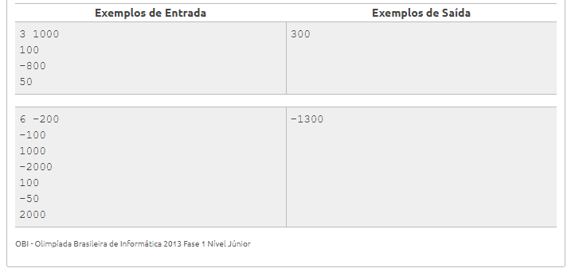

beecrowd | 2434

# Saldo do Vovô

Por OBI - Olimpíada Brasileira de Informática 2013 BR Brazil

Vovô João tem uma banca de jornais; ele tem muitos clientes, e diariamente recebe muito dinheiro, mas também faz muitos pagamentos para manter o seu estoque de jornais e revistas. Todo dia ele vai ao banco realizar um depósito ou uma retirada de dinheiro. Em alguns dias, o saldo de sua conta no banco fica negativo, mas Vovô João tem um acordo com o banco que garante que ele somente é cobrado se o saldo for menor do que um valor pré-estabelecido.

Dada a movimentação diária da conta do banco do Vovô João, você deve escrever um programa que calcule o menor saldo da conta, no período dado.

## Entrada
A primeira linha da entrada contém dois números inteiros N (1 ≤ N ≤ 30) e S (−103 ≤ S ≤ 103) que indicam respectivamente o número de dias do período de interesse e o saldo da conta no início do período. Cada uma das N linhas seguintes contém um número inteiro indicando a movimentação de um dia (−103 ≤ cada movimentação ≤ 103), (valor positivo no caso de depósito, valor negativo no caso de retirada). A movimentação é dada para um período de N dias consecutivos: a primeira das N linhas corresponde ao primeiro dia do período de interesse, a segunda linha corresponde ao segundo dia, e assim por diante.

## Saída
Seu programa deve imprimir uma única linha, contendo um único número inteiro, o menor valor de saldo da conta no período dado.

